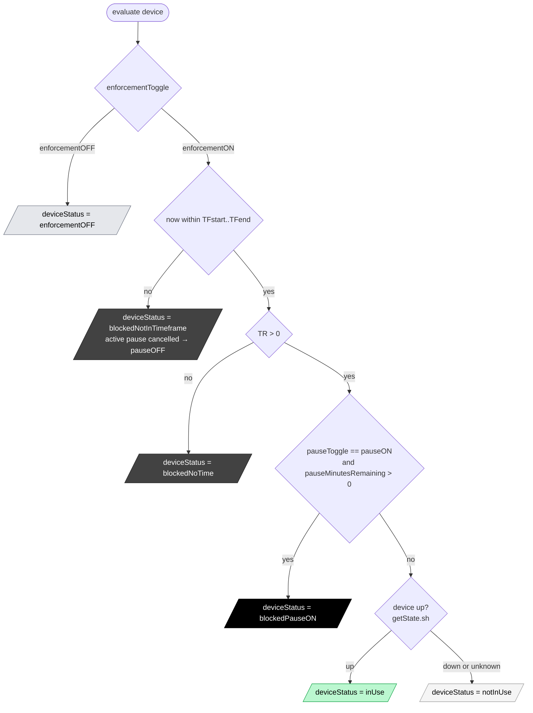

# Kidsout
Webserver for a parental-control webpage of weekly time used/available of multiple devices (tv, xbox, tablet)


# Concepts

[rW] = read by Webpage  
[rB] = read by Backend from configuration  
[cB] = calculated by Backend  
[wB] = written by Backend  
[wU] = written by User (via webpage)  

- user (via browser)
- webpage
- backend
- backend configuration (done by admin in server files):
  - deviceSubdir(s)
- backend runtimestore.yaml (stores runtime vars like time used, time remaining, device status, etc - so webserver withstands restarts without losing the runtime vars)


## general concepts and vars
- `device`
  - `deviceName` (xbox, tv, tablet) [rB]
  - `deviceStatus` (`inUse`, `notInUse`, `blockedNoTime`, `blockedNotInTimeframe`, `blockedPauseON`, `enforcementOFF`) Calculated by backend every 1m and read by webpage [cB][rW]
    Some related vars:  
    - `enforcementToggle` = `enforcementON` (default) or `enforcementOFF` [wU][rW]
    - `pauseToggle` = `pauseON` or `pauseOFF` (default) [wU][rW]
    - `pauseMinutesRemaining` = 20,19,18,...,0 [cB][rW]
    - `stateHistory` = last N (20) up/down/unknown ticks of `getState.sh`, oldest→newest (-1 unknown, 0 down, 1 up); in-memory only (not persisted to runtimestore.yaml), sampled every 1m tick [cB][rW]

  - `deviceSubdir` (devices/xbox, devices/tv, ...) subdir `devices/<deviceName>` where the device scripts are located  [rB]
- `weekday` (fri) [cB]

## concepts per day and per device: 
- `TA` time allowed (2h, 0m, 24h)  [rB][wU][rW]
  - per-weekday recurring: changing TA on FRI (via ➕/➖) applies to every future Friday
  - clamped to 0m..24h
- `TU` time used (1h20m), from the time allowed [cB][rW]
  - increments +1min only when `deviceStatus` is `inUse` (so it does NOT accrue when status is overridden, e.g. `enforcementOFF` or `blockedPauseON`, or when up/down is unknown)
  - resets to 0 at midnight, backend-server local time
- `TR` time remaining (40m), from the time allowed. TR = max(0, TA-TU) [cB][rW]
- `TF` time-frame when device can be used ("09:00-21:00", "00:00-23:59" for all day) [wU][rB][rW]
  - `TFstart` start time of the time-frame (09:00)  [wU][rB]
  - `TFend` end time of the time-frame (21:00) [wU][rB]
  - constraint: `TFstart < TFend` — crossing midnight is forbidden (validated in the time-picker)


# Webpage
- easy to use via mobile, snappy, responsive
- high-density interface: small fonts, compact layout, prefer lines instead of bigger spacy separations

## WeekView: all devices and all 7 weekdays times displayed
```table
|          | **FRI**         | **SAT**        | ...
|:---------|:---------------:|:--------------:|
| **xbox** | ➕    40m    ➖ | ➕  1h40m   ➖ |
  ⏯️    🔒      (1h20m)             (20m)
  inUse       09:00-21:00 🗓    09:00-21:00 🗓

| **tv**   | ➕    40m    ➖ | ➕    40m   ➖ |
  ⏯️    🔒      (1h20m)           (1h20m)
  inUse       10:00-21:00 🗓    10:00-22:00 🗓

| ...      | ...             | ...            | ...
```

## Table
- Table with one row per device, and one column per weekday.
- First header column is the device name, followed by 7 weekday columns starting with the current weekday (ex: FRI) followed by the other 6 in order (so overall: FRI, SAT, SUN, MON, TUE, WED, THU).
- The current weekday column ("today") is visually highlighted, as it's the column users act on most.
- Device rows can be reordered by the user (▲/▼ buttons in the device column); the order is remembered per-browser (localStorage).
- Header row and first-column always visible when scrolling down or right, and with a different header-background-color. Other rows with intercalating light background-colors for easy reading.

## First-header-column
- deviceName shown with:
  - green background-font-color, when `deviceStatus` is `inUse`
  - darkish-grey background-font-color, when `deviceStatus` starts with `blocked` (except `blockedPauseON`)
  - black background-font-color, when `deviceStatus` is `blockedPauseON` (paused)
  - very-light-grey background-font-color, when `deviceStatus` is `notInUse`
  - blue background-font-color, when `deviceStatus` is `enforcementOFF`
  - transparent background-font-color otherwise

- Toggle row: mini-chart (left) + emoji toggle-buttons (right, enforcement-toggle then pause-toggle)

- State-history mini-chart (shown on the left of the toggle row):
  - a small inline SVG sparkline of `stateHistory`, one dot per tick, connected by a line
  - y-axis: 3 fixed levels — up (top), down (middle), unknown (bottom)
  - x-axis: fixed dot-to-dot spacing (one dot-diameter apart); right-most dot is the latest tick, left-most is the oldest; as new ticks arrive, older ones shift left (like a snake scrolling right)
  - dot color per tick: green (up), red (down), grey (unknown); dots are flat/crisp (no glow), at reduced opacity so they don't grab attention
  - faint horizontal gridlines mark the 3 levels behind the line/dots
  - the whole chart fades out towards the left (oldest ticks disappear), fully opaque at the right (latest tick)
  - purely a visual aid to see what's happening close to the device's own perspective (e.g. a device manually turned on then blocked, and whether it's then detected up or down)

- Emoji pause-toggle (shown on the right of the emoji toggle-buttons group): 
  - ⏯️  = pauseON  (block the device for 20m) / ⏯️ = pauseOFF (unpause the device). Same emoji in both states, but with different background colors (none for pauseOFF, lightblue-animated-glowing for pauseON)
  - When pauseON:
    - `deviceStatus` should be overriden to `blockedPauseON`
    - set all device-weekday-cells of this device to info-cell-mode, with info-text "BLOCK-PAUSED for <blocked-minutes-remaining>min"
  - Ghosted (greyed out, not clickable) while `deviceStatus` is `blockedNoTime` or `blockedNotInTimeframe` — pausing has no effect while TF/TR already block the device.
  - When `deviceStatus` changes to `blockedNotInTimeframe` while `pauseToggle` is `pauseON`, the backend cancels the pause (`pauseToggle` → `pauseOFF`, `pauseMinutesRemaining` → 0) so the device stays blocked only due to the timeframe.
  - Ghosted (greyed out, not clickable) while `enforcementToggle` is `enforcementOFF` — pausing is meaningless in free-mode. (The pause-toggle's own button stays live when `pauseON` so it can always be unpaused.)
  - vars:
    - `pauseToggle` = `pauseON` or `pauseOFF` (default)
    - `pauseMinutesRemaining` = 20,19,18,...,0

- Emoji enforcement-toggle (shown on the left of the emoji toggle-buttons group): 
  - 🔓 = enforcementON (block when TR=0 or outside TF) / 🔒 = enforcementOFF (free-use-mode, never block) shown with lightblue-animated-glowing-background
  - Show one of the 2 emojis: during enforcementON show the enforcementOFF emoji, and vice-versa.
  - When enforcementOFF:
    - `deviceStatus` should be overriden to `enforcementOFF`
    - set all device-weekday-cells of this device to info-cell-mode, with info-text "FREE (enforcementOFF)"
  - Ghosted (greyed out, not clickable) while `pauseToggle` is `pauseON` — enforcement and pause are mutually exclusive modes. (The enforcement-toggle's own button stays live when `enforcementOFF` so it can always be re-enabled.)
  - vars:
    - `enforcementToggle` = `enforcementON` (default) or `enforcementOFF`

- `deviceStatus` shown with smaller-font, in light-color, as a non-distractive information


## Device-weekday-cells

Can be in either info-cell-mode or interactive-cell-mode:
- info-cell-mode: contains 3 lines
  ```device-weekday-cell in info-cell-mode 
        |                       |   <--- line1) 
           <INFO_TEXT>          |   <--- line2) 
                                    <--- line3) 
  ```
  - cell greyed out, with different greys for background and foreground colors (still visible)
  - display an info-text (all upcase in different info-font). If info-text is too big to fit within the 3 lines, then show it only in line2 and roll (scroll) horizontally, so the user can read it all.
    The text should be centered vertically and horizontally in the cell. 

- Interactive-cell-mode: contains 3 lines: 
  ```device-weekday-cell in interactive-cell-mode 
        | ➕ Remaining ➖ |   <--- line1) ➕ TR ➖
             (Used)           <--- line2)   (TU)
             TimeFrame 🗓     <--- line3)    TF 🗓
  ```
  - A small `❔` icon in the table corner opens a panel with this annotated cell explanation (only on demand; not auto-shown on first visit). The panel is pinned to the bottom-right of the screen and non-blocking, so the user can still peek at the table while it's open.
  - line1)  TR in normal-font-size in bold, with 2 clickable emojis:
    - `➕` increase time allowed TA+=10m
    - `➖` decrease time allowed TA-=10m
    - changes are per-weekday recurring: ➕ on FRI adds 10m to every future Friday
    - on click, the change is applied optimistically in the UI; rapid taps are debounced/batched on the client (accumulate the delta ~500ms before sending), then the table is updated with the new server values (TR and any others affected)

  - line2) (TU) in normal-font-size in grey (informative info)
  - line3)  TF in smaller-font-size, with 1 clickeable emoji:
    - `🗓` when clicked show a modal dialog with a time-picker to change the TFstart and TFend values, and finally `CANCEL` or `CONFIRM` buttons, after which the change is applied immediately and the table is updated with new values (like the TF value in the cell).
    - the time-picker validates `TFstart < TFend` (crossing midnight is forbidden); `CONFIRM` is disabled while invalid.


# Backend 
## Configuration from deviceSubdirs
```
devices/
  xbox/                <-- deviceName
    getState.sh        <-- returns 1 string on stdout [with exit-code]: "up" [0] or "down" [0] or "unknown" [1] 
    block.sh           <-- blocks the device (returns 0 on success, 1 on error)
    unblock.sh         <-- unblocks the device (returns 0 on success, 1 on error)
  anotherDevice/
    ...
```  
Script contract:
- every script is executed with a 10s timeout; on timeout it is treated as an error (`getState.sh` → "unknown")
- "unknown" state is treated as "down" for the status decision (→ `notInUse`), and TU is not incremented

## Configuration with runtimestore.yaml
local yaml file for backend to store runtime vars, so that the webserver withstands restarts without losing state.

## Authentication
- all pages and API endpoints are protected with HTTP Basic Auth
- credentials are stored in runtimestore.yaml (`auth.username` / `auth.password`), defaulting to user "mae" password "pai"
- stored in plaintext on purpose, so the admin can see and manually change them in the file (checked per-request, no restart needed)
- on a successful Basic Auth login the server also sets an HttpOnly session cookie (random per-run token); all routes accept that cookie. This is required so the SSE `EventSource` (`/api/events`) connection stays authorized — EventSource can't carry Basic Auth reliably, which otherwise makes the browser re-pop the login modal in a loop.


# Overall Execution flow backend-devices-webpage

Every 1min, the backend executes the following flow for every device and weekday:
- copy `deviceStatus` to `prevDeviceStatus`
- calculate the new `deviceStatus` as per [deviceStatus decision flow below](#deviceStatus-decision-flow)
- If `deviceStatus` starts with `blocked`:  
  - if the device is "up" then execute `block.sh` script.  
  Else if `prevDeviceStatus` starts with `blocked` and the new `deviceStatus` does not start with `blocked`, then execute `unblock.sh` script.  
- with new value of `deviceStatus`, calculate the other vars: `pauseMinutesRemaining`, `TR`, `TU` (TU +1min only when `deviceStatus` is `inUse`) (and any other needeed) and store them in the runtimestore.yaml file.  
  
The webpage gets the updated values via SSE (Server-Sent Events), without page reload, and updates the table accordingly.  


## Server lifecycle and shutdown
- On start the backend launches the 1-min evaluation engine and an HTTP server.
- The process listens for `Ctrl-C` (SIGINT) and SIGTERM: on either signal it terminates gracefully — the engine loop stops and the HTTP server is shut down (draining in-flight requests, with a 5s timeout).
- A second `Ctrl-C` restores the default handler and force-quits immediately.
- Runtime state is persisted continuously (atomic rewrites of `runtimestore.yaml` after each evaluation), so no explicit save is needed on shutdown.


## deviceStatus decision flow

How the backend derives `deviceStatus` every 1min from `enforcementToggle`, `pauseToggle`, `pauseMinutesRemaining`, `TR`, `TF` and the device up/down state.



Evaluation order (first match wins):
1. `enforcementToggle == enforcementOFF` → `enforcementOFF` (free-use-mode, never block)
2. now outside `TFstart..TFend` → `blockedNotInTimeframe` (an active pause is cancelled: `pauseToggle` → `pauseOFF`, `pauseMinutesRemaining` → 0 — the device stays blocked only due to the timeframe)
3. `TR == 0` → `blockedNoTime`
4. `pauseToggle == pauseON` and `pauseMinutesRemaining > 0` → `blockedPauseON` (when it hits 0, `pauseToggle` reverts to `pauseOFF`)
5. otherwise allowed → `inUse` if device is up, else `notInUse` (device down or unknown)
