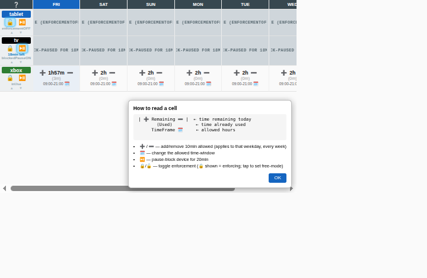
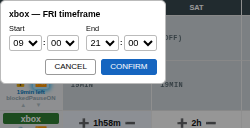
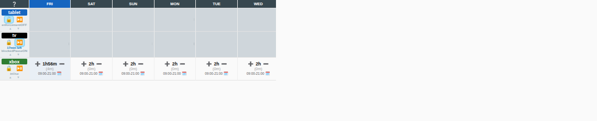

# Kidsout — Administrator Guide

Kidsout is a small self-hosted web app for **parental control of screen time** across
multiple devices (TV, Xbox, tablet, …). It tracks how much time each device has been
used per weekday, enforces per-weekday time limits and allowed time-windows, and can
actually **block/unblock** each device through scripts you provide.

A parent opens one webpage (works great on a phone) and sees a compact week grid: one
row per device, one column per weekday. From there they can add/remove allowed minutes,
change the allowed hours, pause a device for 20 minutes, or unlock for
free-use-mode. 


---

## What it does for you

- **Weekly time budget per device** — set how many minutes are allowed each weekday
  (e.g. Xbox gets 2h on Saturday, 40m on Monday). Limits are recurring: changing
  Friday applies to *every* Friday.
- **Time-frame windows** — restrict usage to a daily window (e.g. `09:00–21:00`).
- **Automatic enforcement** — every minute the backend decides each device's status and
  runs your `block.sh` / `unblock.sh` when it crosses a boundary (out of time, outside
  the window, paused, …).
- **Live status** — the page updates in real time via Server-Sent Events; a device shows
  as `inUse`, `notInUse`, or one of the `blocked*` states.
- **Quick overrides** — a 20-minute **pause** (dinner time), or **free-use-mode**
  that never blocks (and does not count against the use-time).
- **Survives restarts** — all runtime state is persisted to `runtimestore.yaml`.

### Device status values

| Status | Meaning |
|---|---|
| `inUse` | Allowed and the device is currently up |
| `notInUse` | Allowed but the device is down/unknown |
| `blockedNoTime` | Time remaining reached 0 |
| `blockedNotInTimeframe` | Current time is outside the allowed window (an active pause is cancelled) |
| `blockedPauseON` | Manually paused (20-min countdown) |
| `enforcementOFF` | Free-use-mode; never blocks |

Every minute the status is derived in this order (first match wins):
enforcement-off → outside time-frame → no time left → paused → up/down.
When the status becomes `blockedNotInTimeframe`, an active pause is switched
back to `pauseOFF` so the device stays blocked only due to the timeframe.

---

## Parent - How to use

Open the site and log in with the configured username/password. You'll see the week grid.

**Reading a cell** — tap the `❔` in the top-left corner for an on-screen legend:



Each interactive cell has three lines:

- **Line 1** — remaining time today, with `➕` / `➖` to add or remove 10 minutes of the
  allowed time. Changes are *per-weekday recurring* (adding to Friday adds to every
  Friday). Rapid taps are batched before saving.
- **Line 2** — `(used)` time so far today.
- **Line 3** — the allowed time-window, with `🗓` to change it.

**Changing the allowed hours** — tap `🗓` on a cell to pick start/end. Crossing midnight
is not allowed, so `CONFIRM` stays disabled until `start < end`:



**Per-device controls** (in the device name column):

- `🔒` / `🔓` — toggle **enforcement**. `🔒` shown = currently enforcing; tap it to switch
  to free-use-mode (`🔓`), where the device is never blocked and its time is **not**
  counted against the daily budget.
- `⏯️` — **pause** the device for 20 minutes (great for forcing a temporary break). Ghosted when the device
  is already blocked by its time/window.
- `▲` / `▼` — reorder device rows (remembered per browser).

**Live states** — the device name is color-coded and the cells reflect the current
status. Below: `tablet` is in free-use-mode (blue, `FREE`), `tv` is paused
(black, `BLOCK-PAUSED`), `xbox` is in use (green). A device that's allowed but
currently down (`notInUse`) shows a very-light-grey background:



The whole page updates automatically as the backend re-evaluates every minute — no
refresh needed.

---

## Install

Requirements: **Go 1.25+** and a Linux/Unix host. The only dependency is
`gopkg.in/yaml.v3` (fetched automatically).

```bash
# 1. Get the code
git clone <your-repo-url> kidsout
cd kidsout

# 2. Build a static binary  (produces ./kidsout)
./go_build.sh

# 3. Run it
./kidsout
```

Or run without building a binary:

```bash
./go_run.sh          # go run .
```

On start you should see:

```
2026/07/31 19:44:07 devices: [tablet tv xbox]
2026/07/31 19:44:07 listening on :8080
```

Open http://localhost:8080/ and log in (default `mae` / `pai` — change this, see below).

New devices start with **enforcement OFF** so nothing is blocked until you're ready.
At setup, review each device in the web UI and tap `🔓` to switch it to `🔒`
(enforcement ON) once its time limits and windows look right.

### Stopping

Press `Ctrl-C` in the terminal to
shut down gracefully: the evaluation loop stops and the web server drains in-flight
requests before exiting. Runtime state is already saved continuously to
`runtimestore.yaml`, so nothing is lost. A second `Ctrl-C` forces an immediate quit.

### Minimum files for production

A production host only needs:

```
/opt/kidsout/
  kidsout                  # the static binary 
  devices/                 # your device scripts (see "Adding devices")
    <name>/
      getState.sh
      block.sh
      unblock.sh
```

`runtimestore.yaml` is created automatically on first run — just make sure its
location (`KIDSOUT_RUNTIMESTORE`, default: working directory) is writable. 


### Running as a service (example)

A minimal `systemd` unit:

```ini
# /etc/systemd/system/kidsout.service
[Unit]
Description=Kidsout parental control
After=network.target

[Service]
WorkingDirectory=/opt/kidsout
ExecStart=/opt/kidsout/kidsout
Environment=KIDSOUT_LISTEN=:8080
Restart=on-failure
User=kidsout

[Install]
WantedBy=multi-user.target
```

```bash
sudo systemctl enable --now kidsout
```

---

## Configuration

Kidsout is configured through **environment variables** (paths/port) and two files that
live next to the binary.

### Environment variables

| Variable | Default | Purpose |
|---|---|---|
| `KIDSOUT_LISTEN` | `:8080` | Address/port to listen on |
| `KIDSOUT_DEVICES_DIR` | `devices` | Folder holding one sub-folder per device |
| `KIDSOUT_RUNTIMESTORE` | `runtimestore.yaml` | Where runtime state is persisted |

Example:

```bash
KIDSOUT_LISTEN=:9000 \
KIDSOUT_DEVICES_DIR=/opt/kidsout/devices \
KIDSOUT_RUNTIMESTORE=/var/lib/kidsout/state.yaml \
./kidsout
```

### `runtimestore.yaml`

This file is created automatically on first run and rewritten atomically as state
changes. It holds the auth credentials and per-device / per-weekday runtime values.
You normally don't edit it by hand, **except** for the credentials.

```yaml
auth:
  username: mae
  password: pai            # plaintext on purpose — change it, no restart needed
lastTickDate: "2026-07-31"
devices:
  xbox:
    enforcementToggle: enforcementOFF   # default for new devices; enable it from the web UI at setup
    pauseToggle: pauseOFF
    pauseMinutesRemaining: 0
    deviceStatus: notInUse
    days:
      fri:
        taMinutes: 120      # time Allowed
        tuMinutes: 0        # time Used today
        tfStart: "09:00"    # window start
        tfEnd: "21:00"      # window end
      sat: { taMinutes: 120, tuMinutes: 0, tfStart: "09:00", tfEnd: "21:00" }
      # ... mon..sun
```

> **Authentication:** every page and API endpoint is protected with HTTP Basic Auth.
> The credentials are read from `runtimestore.yaml` on every request, so you can change
> them by editing the file — no restart required. They are stored in plaintext
> deliberately so you can read/reset them. **Change the defaults before exposing the
> service.** If you put Kidsout on a network, front it with HTTPS (e.g. a reverse proxy)
> so the Basic Auth credentials aren't sent in the clear.

---

## Adding devices

A "device" is simply a sub-folder under the devices directory containing **three
executable scripts**. Kidsout discovers devices at startup by scanning for folders:

```
devices/
  xbox/                <-- device name shown in the UI
    getState.sh
    block.sh
    unblock.sh
  tablet/
    ...
```

### Script contract

**Tl;dr:** calls every minute `getState.sh` for `up`/`down`. `block.sh` called every minute when  device is expected `down` (blocked) but is found `up`. `unblock.sh` called once when going blocked -> unblocked. Every script must complete within 10s timeout.

| Script | Called when | Must output | Exit code |
|---|---|---|---|
| `getState.sh` | Every minute (and on each UI action) | one word on stdout: `up`, `down`, or `unknown` | `0` on success; non-zero ⇒ treated as `unknown` |
| `block.sh` | When the device should be blocked and is currently `up` | — | `0` on success, non-zero on error |
| `unblock.sh` | When a previously-blocked device becomes allowed again | — | `0` on success, non-zero on error |

Rules and requirements:

- All three scripts must be **executable** (`chmod +x`).
- Each script is run with a **10-second timeout**; a timeout counts as an error
  (`getState.sh` → `unknown`).
- `unknown` is treated like `down` for decisions, and **time-used does not accrue**.
- `block`/`unblock` are **edge-triggered**: `block.sh` runs while blocked and up;
  `unblock.sh` runs once when leaving a blocked state.
- After adding/removing a device folder, **restart** Kidsout so it re-discovers devices.
  (Devices removed from disk are dropped from the store; new ones get sensible defaults.)

### Example: real device using firewall rules

`getState.sh` — report whether the console is online (here: does it answer ping):

```bash
#!/usr/bin/env bash
if ping -c1 -W1 192.168.1.50 >/dev/null 2>&1; then
  echo "up"
else
  echo "down"
fi
exit 0
```

`block.sh` — drop its traffic:

```bash
#!/usr/bin/env bash
sudo nft add rule inet filter forward ip saddr 192.168.1.50 drop
exit $?
```

`unblock.sh` — remove the rule:

```bash
#!/usr/bin/env bash
# delete the matching rule (look up its handle, then delete)
handle=$(sudo nft -a list chain inet filter forward \
  | awk '/192.168.1.50 drop/ {print $NF; exit}')
[[ -n "$handle" ]] && sudo nft delete rule inet filter forward handle "$handle"
exit 0
```

> The bundled `devices/{tv,xbox,tablet}` are **demo stubs**: they track state with a
> local `.blocked` marker file instead of touching a real device. Use them as a template.

---


## Remote automation

Additionally, for remote configuration:
- see **[kidsoutctl](kidsoutctl/README.md)**, a kubectl-style
command-line client for Kidsout: view device status as colored tables (or JSON/YAML),
watch live updates, pause/enforce devices, and adjust time limits from the shell.

- see the [HTTP API reference](README_API.md)


## Troubleshooting

| Symptom | Likely cause / fix |
|---|---|
| `no devices found in devices ...` at startup | The devices dir has no sub-folder containing all three scripts. Check `KIDSOUT_DEVICES_DIR` and that each device has `getState.sh`, `block.sh`, `unblock.sh`. |
| A device never blocks | `getState.sh` never returns `up`, or `block.sh` exits non-zero. Test manually: `devices/xbox/getState.sh; echo $?`. |
| Status stuck on `notInUse` / `unknown` | `getState.sh` errors or exceeds the 10s timeout. Timeouts and errors are treated as `unknown` → `notInUse`, and used-time won't accrue. |
| A device won't unblock | `unblock.sh` exits non-zero, or nothing changed its blocking condition. Remember unblock is edge-triggered — it runs once when leaving a blocked state. |
| Login prompt keeps reappearing | Wrong credentials, or a proxy stripping the auth cookie. Kidsout sets a session cookie after Basic Auth so SSE works; make sure your reverse proxy forwards cookies and the `/api/events` stream. |
| Changes don't persist across restarts | The process can't write `runtimestore.yaml`. Check the path in `KIDSOUT_RUNTIMESTORE` and that the working directory / file is writable. |
| Used-time resets unexpectedly | Time-used resets at **midnight, server local time**. Verify the server's timezone/clock. |

**Logs** — Kidsout logs discovered devices, script failures, and save errors to stderr
(e.g. `engine: xbox/block.sh failed: ...`). When running under systemd, view them with
`journalctl -u kidsout -f`.

**Quick manual API check** (Basic Auth required):

```bash
curl -s -u mae:pai http://localhost:8080/api/state | jq .
```
