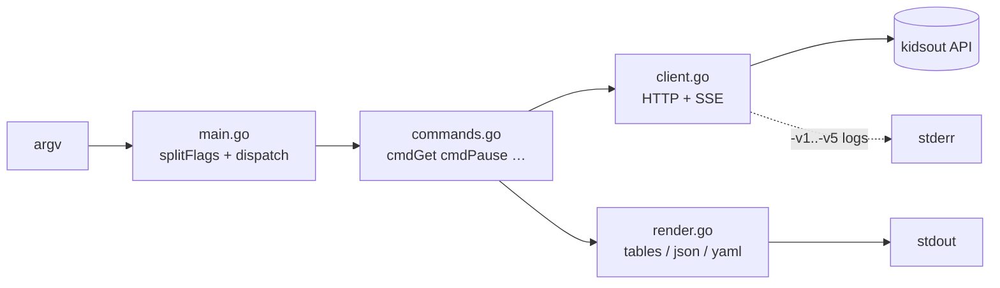

# kidsoutctl — Design

## Goals

- **Human-first, script-friendly.** Colored, aligned tables on a TTY; exact
  API payloads with `-o json|yaml` for pipes and automation.
- **kubectl ergonomics.** `verb [resource...] [flags]` grammar, flags allowed
  before *or* after positionals, `--all` fan-out, `watch`, shell completion,
  meaningful exit codes.
- **Zero new dependencies.** Standard library plus `gopkg.in/yaml.v3`, which
  the parent module already ships.
- **Secrets stay out of argv.** Credentials come only from `KOAUTH` /
  `KIDSOUT_AUTH` environment variables — never a flag — and are redacted in
  verbose header dumps.

## Non-goals

- No config file / contexts (kubeconfig-style). One server, two env vars.
- No local state or caching — the server is always the source of truth.
- No API changes; the CLI is a pure consumer of [README_API.md](../README_API.md).

## Architecture

Four small files, one `main` package (`kidsout/kidsoutctl`):

```
main.go       flag parsing, command dispatch, usage text, exit-code mapping
commands.go   one handler per verb (app struct: client + options + writers)
client.go     typed API client: State structs, do(), SSE Watch(), leveled logging
render.go     painter (ANSI), table writer, status→color map, json/yaml emitters
```



## Key decisions

### Flag parsing: stdlib with interspersed positionals

Cobra would be the obvious choice, but it drags in a dependency tree for a
seven-verb CLI. Instead `splitFlags()` loops `flag.FlagSet.Parse`, collecting
non-flag tokens, which yields kubectl-style interspersed flags
(`kidsoutctl get xbox -o yaml` and `kidsoutctl -o yaml get xbox` both work).

One subtlety: `ta xbox fri -15` — a bare `-15` looks like a flag. A
`^-\d+$` guard treats negative integers as positionals, and `--` ends flag
parsing entirely (POSIX escape hatch).

Verbosity is five boolean flags `-v1`…`-v5` (highest one wins) rather than
`--v=N`, matching the requested UX.

### Toggle verbs are paired commands, not arguments

`pause`/`unpause` and `enforce`/`unenforce` instead of
`pause xbox on|off`. Rationale: the intent is unambiguous in shell history,
completion is trivial, and it reads like English. `resume` is an alias for
`unpause`.

### Output: exact payload for machines, derived view for humans

- `-o json|yaml` re-emits the **untouched** `/api/state` body (pretty-printed
  / converted), so scripts see exactly what the API documents — the CLI never
  invents fields.
- The default table is a *derived* view: today's row per device, minutes
  humanized (`2h05m`), status colored by severity (green `inUse`, red
  `blocked*`, yellow `blockedPauseON`, cyan `enforcementOFF`), remaining time
  turning yellow ≤15 min and red at 0.
- Color is `auto` (TTY sniff via `os.ModeCharDevice`), overridable with
  `--color always|never`, and [`NO_COLOR`](https://no-color.org) is honored.
  Piped output is automatically plain.

### Verbosity levels (all on stderr, never stdout)

| Level | Adds |
|---|---|
| `-v1` | request lines (`POST /api/device/xbox/pause`) |
| `-v2` | response status + round-trip timing |
| `-v3` | request/response headers, `Authorization`/`Set-Cookie` **redacted** |
| `-v4` | request/response bodies |
| `-v5` | connection trace via `net/http/httptrace` (DNS, connect, reuse) |

stdout stays parseable at any verbosity: `kidsoutctl get -o json -v5 | jq .`
works.

### Watch: SSE, not polling

`watch` consumes `/api/events` with a hand-rolled SSE reader (~40 lines —
`data:` accumulation, blank-line dispatch, `:` keepalives). No client timeout
on the streaming request; Ctrl-C is handled via `signal.NotifyContext`.
`--once` gives scripts a single consistent snapshot through the same code
path.

### Exit codes map to API semantics

`0` ok · `1` runtime/API error · `2` usage · `3` auth (missing env or 401) ·
`4` conflict (409, e.g. pausing an already-blocked device). Documented in the
API's response-code table; lets cron jobs distinguish "wrong password" from
"pause had no effect".

Fan-out commands (`pause --all`) continue on per-device failure, report each
error, and exit `1` if any failed.

### Client-side validation is a courtesy, not a gate

Weekday names, `HH:MM` shape, `tfStart < tfEnd`, non-zero delta are checked
locally for fast, friendly errors (exit `2`), but the server remains the
authority — anything else surfaces as its HTTP error.

`today` as a weekday argument resolves via `/api/state`'s `today` field
(server-local time), avoiding client/server timezone drift.

## Error handling model

Three error kinds flow up to a single `exitCode()` mapper in main:

- `usageError` (string) → print + exit 2
- `*APIError` (status + body) → print, 401→3, 409→4, else 1
- `exitError{code}` → silent exit (message already printed, e.g. fan-out)

## Testing

`main_test.go` drives the real `run()` entry point against
`net/http/httptest` servers — full-stack coverage (flag parsing → HTTP →
rendering) without a live kidsout instance. Covers: table/json/yaml output,
week view, every mutation verb and its exact POST payload, `--all` fan-out,
`ta today` resolution, validation failures, exit codes 2/3/4, SSE
`watch --once`, and interspersed/negative-number flag parsing.

## Build

`go_build.sh` mirrors the parent project's script: static linux binary
(`CGO_ENABLED=0`), git commit stamped via
`-ldflags "-X main.commit=..."`.
